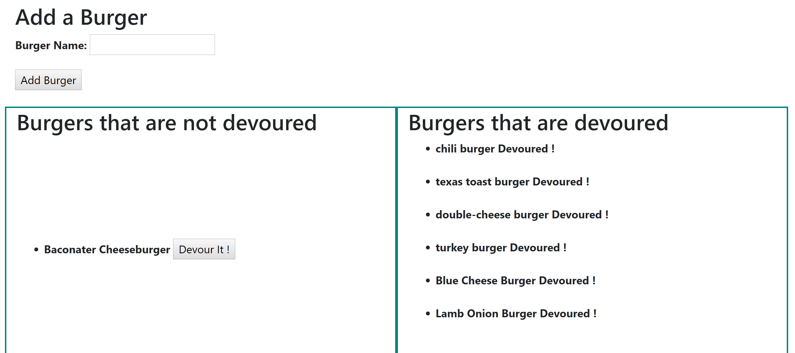

# Eat Da Burger !

---
### Overview
---

This application is a burger logger, creted with with MySQL, Node, Express, Handlebars and a homemade ORM. The MVC design pattern is used for the appliction, with Node, MySQL to query and route data in the application, and Handlebars for the HTML views.

The application will store each burger's devoured state, in the MySql database.

---
### Using the Application
---

* Eat-Da-Burger! is a restaurant app that lets the user input the names of burgers they'd like to eat.

* Whenever a user submits a burger's name, the application will display the burger on the left side of the page,  with a `Devour It!` button. Click the button to devour the burger!

* Once a burger is devoured, it will be moved over to the right hand side, which shows all burgers that have been devoured.

